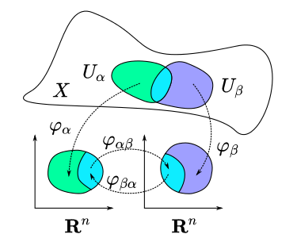

Extended Guide
==============
Some manifolds require extra introduction rather that brief notes in the manifolds.
This may include comprehensive guides, beautiful plots, examples and more. Contributions are welcome.

`Disclamer`: This guide is not supposed to be an exhaustive reference (but tries to).
It is mostly written enthusiastically in a learning and writing manner, so if you spot any mistakes or
typos or just want to improve it, do not hesitate to `open a PR <https://github.com/ferrine/geoopt/pulls/>`_ with your corrections.

`The introduction was prepared using materials from different sources` ([1]_, [2]_, [3]_).

Introduction
------------
Riemannian manifold is usually associated with a smooth surface in an embedded space. Common examples are sphere,
hyperboloid, orthogonal matrices. Less common examples are distributions and are studied by informational geometry [4]_.
The challenging thing in working with manifolds is parametrization. The first problem you have is to pick up a
coordinate system for the manifold. But it is not always possible to cover the surface with a single "map" smoothly.
Moreover, the coordinate system is not unique and each coordinate system should be treated in a special way.

Motivation
~~~~~~~~~~
Manifolds appear in many practical and theoretical problems and applications. For example, finding a largest eigenvalue
may be treated as an optimization on a Sphere manifold. Another useful task, is pose estimation and motion recovery that
can be treated as an optimization problem in a special orthogonal group (rotations). Some exciting examples include
deep learning applications ([5]_, [2]_) and embedding problems ([6]_). Recent works also show that accelerated adaptive
methods can be applied to the Riemannian case ([7]_). Other works show tight connections of Riemannian optimization and
Mirror descent ([8]_).

Charts and Atlases
~~~~~~~~~~~~~~~~~~
As mentioned above, we need some coordinate system to work with a manifold :math:`\mathcal{M}`. :math:`\mathcal{M}` may
or may not be embedded in :math:`\mathbb{R}`. However, we are assumed to create can create this map locally,
call it *chart* :math:`\phi \in \mathcal{A} \::\: U \in \mathcal{M} \to R^n` forming coordinates :math:`\theta`. What we want from :math:`\phi` is smoothness and being bijective.
This map is not unique, we may not even find a one global map for all the :math:`\mathcal{M}`. A set of all possible charts forms an *atlas*
:math:`\mathcal{A} = \bigl\{\phi\::\: U \in \mathcal{M} \to R^n\bigr\}`. The concrete chart :math:`\phi` provides you not
only with "local" coordinates :math:`\theta`. It allows you to study curves on the manifold, tangent spaces, derivatives.

Tangent Spaces
~~~~~~~~~~~~~~
Tangent space :math:`T_x\mathcal{M}` is an important concept. Tangent space is usually associated with a
set of all curves passing through :math:`x` that is more formally

.. math::

    T_x\mathcal{M} = \bigl\{\dot\gamma\:s.t.\: \gamma : \mathbb{R} \to \mathcal{M}, \gamma(0)=x\bigr\}

An element in :math:`T_x\mathcal{M}` defines a direction to move on the manifold. As we can only operate
with local coordinates :math:`\theta`, we need to relate a vector in tangent space with coordinates :math:`\theta`.
This basis is formed with partial derivative operators :math:`\frac{\partial}{\partial\theta_i}=\partial_i`.

It is easier to think of it as a set of curves with local basis forming initial conditions.
Moreover this space is tightly related with differential operators. Having a function
:math:`f\::\:\mathcal{M}\to \mathbb{R}` we now need :math:`\phi` to make a connection with derivatives
and local basis in the tangent space. Consider :math:`x\in \mathcal{M}` and :math:`\phi(x)=\theta`.
Note, that we have a locally smooth :math:`\phi` and its inverse (it is one-to-one). So, basically we can get
curves :math:`\gamma(t)` in extrinsic coordinates :math:`\theta`. With differential operators
:math:`\left\{\frac{\partial}{\partial\theta}\right\}` we are able to
form a basis in the tangent space :math:`T_x\mathcal{M}`. Differentials obtained via
differentiation or whatever form initial conditions on curves :math:`\dot\gamma` and under mild
assumptions form a uniquely defined :math:`\gamma \in T_x\mathcal{M}`.

One may note that we are free to pick up any :math:`\phi\in\mathcal{A}` and this leads to a
different set of differentials. But we would expect our function over :math:`\mathcal{M}` to have uniquely
defined `derivative` :math:`\gamma(t)`.

Differential oparators :math:`\left\{\frac{\partial}{\partial\theta_1}\dots \frac{\partial}{\partial\theta_n}\right\}`
form a vector space :math:`V` and have a corresponding dual space of all linear operators :math:`V^*=T^*_x\mathcal{M}`.
This dual space is called `cotangent space`. Covectors :math:`\left\{d\theta_1\dots d\theta_n\right\}` form
a dual basis. The important thing to know is that :math:`d\theta^j(\frac{\partial}{\partial\theta_i})=\delta^j_i`
where :math:`\delta^j_i` is a Kronecker delta. Intuitively that means irrespectively to the parametrization
we obtain the same :math:`\gamma(t)`.

As said above, cotangent space is an important thing. Recalling metric tensor :math:`g_x` we may
define it more formally as a symmetric bilinear positive definite operator
:math:`g_x \in T^*_x\mathcal{M} \times T^*_x\mathcal{M}`. The crucial thing here is that it depends
on parametrization we use! Different sources write inner product on tangent space in very different ways.
Common are:

1. :math:`\langle a, b\rangle_x`: tiny and compact, but this does not reflect parametrization issue.
2. :math:`g_{\mu\nu} d \theta^\mu \otimes d\theta^\nu (a^\mu \partial_\mu, b^\nu\partial_\nu)`:
    Einstein summation. Probably the best way to do this but may very hard to read. However, it reflects
    all the issues with parametrization.

We will use both notations choosing the one that is more suitable for reading and understanding.

:math:`g_x` metric tensor allows to obtain a wide range of concepts and operators around the manifold.

Geodesics
~~~~~~~~~
Consider two points on the manifold :math:`x,y\in\mathcal{M}`. How do we obtain the
shortest path curve between them? To do that properly, we need and additional concept
and a use of differential basis.

Consider vector :math:`\nabla_\mu\partial_\nu`. It represents the change of
basis moving along direction :math:`\partial_\nu`. To compute this vector we need
to take manifold structure in account. Metric tensor the one :math:`g_x` that
induces that structure in terms of angles, curvature and more, so the use of it here is obvious.
Here we define a `connection` :math:`\Gamma_{\mu\nu}^\alpha` (Levi-Civita connection) that allows
shorter notation for :math:`\nabla_\mu\partial_\nu=\Gamma_{\mu\nu}^\alpha\partial_\alpha`.
The `connection` :math:`\Gamma_{\mu\nu}^\alpha` is of form

.. math::

    \Gamma_{\mu\nu}^\alpha = \frac{1}{2}g^{\alpha\beta}\left(
        \partial_\mu g_{\beta\nu} + \partial_\nu g_{\beta\mu} - \partial_\beta g_{\mu\nu}
    \right)

Thus, a parametrization :math:`\phi` not only uniquely defines :math:`g_x`, but also a :math:`\Gamma_{\mu\nu}^\alpha`.
Moreover we got operators over vector fields :math:`V\times V^*`. To see that, we need to represent a vector :math:`\mathbf{a}\in V`
in its basis :math:`\mathbf{a}=a^\nu\partial_\nu` and another covector :math:`\mathbf{b}=b^\mu\nabla_\mu`. Here we go

.. math::

    \nabla_{\mathbf{b}} \mathbf{a} = b^\mu \nabla_\mu (a^\nu \partial_\nu) = b^\mu (\partial_\mu a^\nu) \partial_\nu + b^\mu a^\nu \Gamma_{\mu\nu}^\alpha \partial_\alpha.

Playing with differential equations we may get a solution :math:`\gamma(t)` with desired properties.

Parallel Transport
    Parallel transport for a vector :math:`\mathbf{a}` along curve :math:`\gamma(t)` is such
    that the basis is locally not disturbed. This can be expressed via a differential
    equation :math:`\nabla_{\dot\gamma(t)}\mathbf{a}(t)=0` so we ensure local consistency.

Straight line
    Straight line in Riemannian geometry is a curve :math:`\gamma(t)` such that its
    :math:`\dot\gamma(t)` is transported along the curve and propatated. This resembles impulse
    that does not change over time and serves as moving direction. We can again express this via
    differential equation

    .. math::

        \nabla_{\dot\gamma}\dot\gamma = 0\\
        = \ddot\theta^\alpha + \Gamma_{\mu\nu}^\alpha \dot\theta^\mu \dot \theta^\nu = 0

    The solutions for this equation equations have nice properties such as constant speed
    and local distance minimization. Note, we have a second order equation, thus
    it requires two conditions to determine the solution curve :math:`\gamma`.
    This can be done via either two points on the manifold :math:`x,y\in\mathcal{M}` or
    initial point with its velocity :math:`x\in\mathcal{M}` and :math:`v\in T_x\mathcal{M}`.
    While the second solution exists uniquely, the first one may be not unique. Imagine a sphere
    and two points on poles, there exist infinitely many shortest path curves that connect these poles.
    However, such corner cases are of not much interest here.

Exponential map
    The second case above is very important as it
    allows to introduce so called `exponential map`

    .. math::

        \operatorname{Exp}_x(v)\::\: T_x\mathcal{M} \to \mathcal{M} = \gamma(1)\\
        \text{s.t.}\;\gamma(0)=x\\
        \dot\gamma(0)=v

Logarithmic Map
    This is an inverse of exponential map and defined as follows

    .. math::

        \operatorname{Log}_x(y)\::\:\mathcal{M}\to T_x\mathcal{M} = v\\
        \text{s.t.}\;\operatorname{Exp}_x(v)=y\\

.. [1] P.-A. Absil, Optimization Algorithms on Matrix Manifolds, 2007
.. [2] Yang Song et al., Accelerating Natural Gradient with Higher-Order Invariance, ICML 2018
.. [3] Lee John, Introduction to Riemannian Manifolds, 1991
.. [4] Amari, Shun-ichi, Information Geometry and Its Applications, 2016
.. [5] Octavian-Eugen Ganea et al. , Hyperbolic Neural Networks, NIPS 2018
.. [6] Maximillian Nickel & Douwe Kiela, Poincaré Embeddings for Learning Hierarchical Representations, NIPS 2017
.. [7] Gary Becigneul & Octavian-Eugen Ganea, Riemannian Adaptive Optimization Methods, ICLR 2019
.. [8] Garvesh Raskutti & Sayan Mukherjee, The Information Geometry of Mirror Descent, IEEE Transactions on Information Theory, 2018
