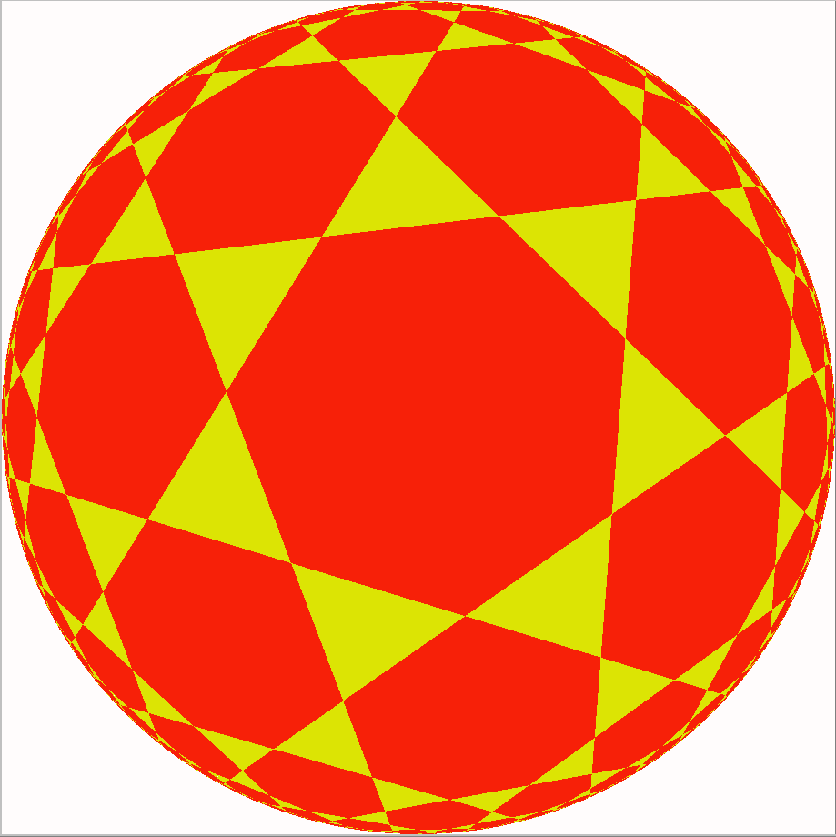
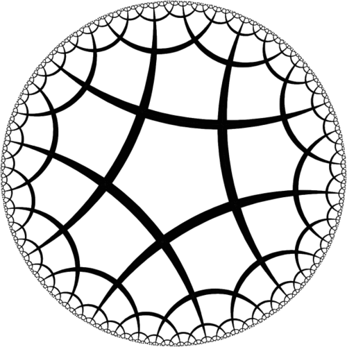

Poincare Ball model
===================

Poincare ball model is a compact representation of hyperbolic space.
To have a nice introduction into this model we should start from
simple concepts, putting them all together to build a more complete picture.

Hyperbolic spaces
-----------------

Hyperbolic space is a constant negative curvature Riemannian manifold.
A very simple example of Riemannian manifold with constant, but positive curvature is sphere.

An (N+1)-dimensional hyperboloid spans the manifold that can be embedded into N-dimensional space via projections.

.. figure:: ../plots/extended/poincare/hyperboloid_projection.png
   :width: 300

   img source `Wikipedia, Hyperboloid Model <https://en.wikipedia.org/wiki/Hyperboloid_model/>`_

Originally, the distance between points on the hyperboloid is defined as

.. math::

    d(x, y) = \operatorname{arccosh}(x, y)

It is difficult to work in (N+1)-dimensional space and there is a range of useful embeddings
exist in literature

Klein Model
~~~~~~~~~~~

   img source `Wikipedia, Klein Model <https://en.wikipedia.org/wiki/Beltrami-Klein_model/>`_

Poincare Model
~~~~~~~~~~~~~~

   img source `Bulatov, Poincare Model <http://bulatov.org/math/1001/>`_

Here we go.

First of all we note, that Poincare ball is embedded in a Sphere of radius :math:`r=1/\sqrt{c}`,
where c is negative curvature. We also note, as :math:`c` goes to :math:`0`, we recover infinite radius ball.
We should expect this limiting behaviour recovers Euclidean geometry.

To connect Euclidean space with its embedded manifold we need to get :math:`g_x`.
It is done via `conformal factor` :math:`\lambda^c_x`.

.. autofunction:: geoopt.manifolds.poincare.math.lambda_x

:math:`\lambda^c_x` connects Euclidean inner product with Riemannian one

.. autofunction:: geoopt.manifolds.poincare.math.inner
.. autofunction:: geoopt.manifolds.poincare.math.norm
.. autofunction:: geoopt.manifolds.poincare.math.egrad2rgrad

Math
----
The good thing about Poincare ball is that it forms a Gyrogroup. Minimal definition of a Gyrogroup
assumes a binary operation :math:`*` defined that satisfies a set of properties.

Left identity
    For every element :math:`a\in G` there exist :math:`e\in G` such that :math:`e * a = a`.
Left Inverse
    For every element :math:`a\in G` there exist :math:`b\in G` such that :math:`b * a = e`
Gyroassociativity
    For any :math:`a,b,c\in G` there exist :math:`gyr[a, b]c\in G` such that :math:`a * (b * c)=(a * b) * gyr[a, b]c`
Gyroautomorphism
    :math:`gyr[a, b]` is a magma automorphism in G
Left loop
    :math:`gyr[a, b] = gyr[a * b, b]`

As mentioned above, hyperbolic space forms a Gyrogroup equipped with

.. autofunction:: geoopt.manifolds.poincare.math.mobius_add
.. autofunction:: geoopt.manifolds.poincare.math.gyration

Using this math, it is possible to define another useful operations

.. autofunction:: geoopt.manifolds.poincare.math.mobius_sub
.. autofunction:: geoopt.manifolds.poincare.math.mobius_scalar_mul
.. autofunction:: geoopt.manifolds.poincare.math.mobius_pointwise_mul
.. autofunction:: geoopt.manifolds.poincare.math.mobius_matvec
.. autofunction:: geoopt.manifolds.poincare.math.mobius_fn_apply
.. autofunction:: geoopt.manifolds.poincare.math.mobius_fn_apply_chain

Manifold
--------
Now we are ready to proceed with studying distances, geodesics, exponential maps and more

.. autofunction:: geoopt.manifolds.poincare.math.dist
.. autofunction:: geoopt.manifolds.poincare.math.dist2plane
.. autofunction:: geoopt.manifolds.poincare.math.parallel_transport
.. autofunction:: geoopt.manifolds.poincare.math.geodesic
.. autofunction:: geoopt.manifolds.poincare.math.geodesic_unit
.. autofunction:: geoopt.manifolds.poincare.math.expmap
.. autofunction:: geoopt.manifolds.poincare.math.expmap0
.. autofunction:: geoopt.manifolds.poincare.math.logmap
.. autofunction:: geoopt.manifolds.poincare.math.logmap0

Stability
---------
Numerical stability is a pain in this model. It is strongly recommended to work in ``float64``,
so expect adventures in ``float32`` (but this is not certain).

.. autofunction:: geoopt.manifolds.poincare.math.project
