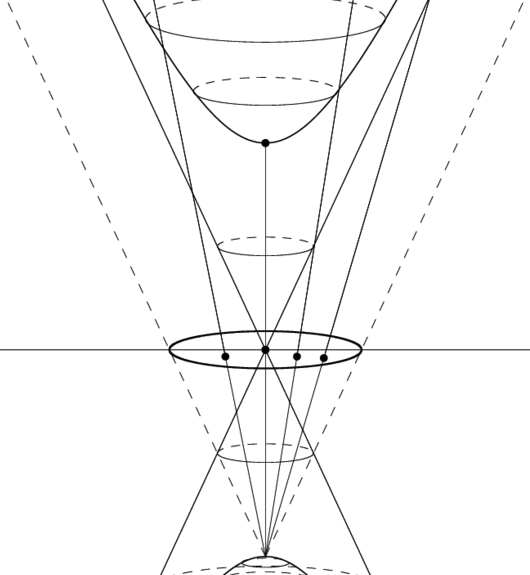
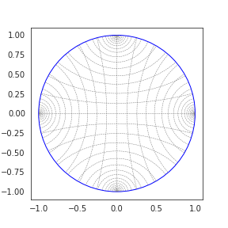
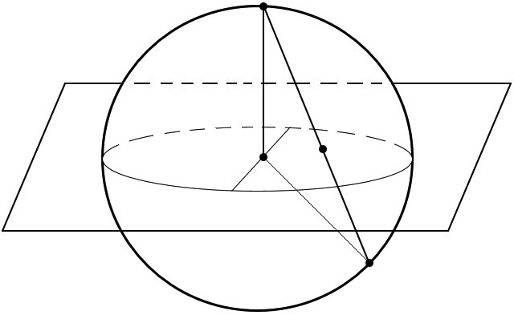
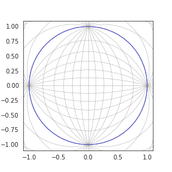

:math:`\kappa`-Stereographic Projection model
=============================================

Stereographic projection models comes to bind constant curvature spaces. Such as spheres,
hyperboloids and regular Euclidean manifold. Let's look at what does this mean. As we mentioned
constant curvature, let's name this constant :math:`\kappa`.

Hyperbolic spaces
-----------------

Hyperbolic space is a constant negative curvature (:math:`\kappa < 0`) Riemannian manifold.
(A very simple example of Riemannian manifold with constant, but positive curvature is sphere, we'll be back to it later)

An (N+1)-dimensional hyperboloid spans the manifold that can be embedded into N-dimensional space via projections.

Originally, the distance between points on the hyperboloid is defined as

.. math::

    d(x, y) = \operatorname{arccosh}(x, y)

Not to work with this manifold, it is convenient to project the hyperboloid onto a plane. We can do it in many ways
recovering embedded manifolds with different properties (usually numerical). To connect constant curvature
manifolds we better use Poincare ball model (aka stereographic projection model).

Poincare Model
~~~~~~~~~~~~~~

   Grid of Geodesics for :math:`\kappa=-1`, credits to `Andreas Bloch`_

First of all we note, that Poincare ball is embedded in a Sphere of radius :math:`r=1/\sqrt{\kappa}`,
where c is negative curvature. We also note, as :math:`\kappa` goes to :math:`0`, we recover infinite radius ball.
We should expect this limiting behaviour recovers Euclidean geometry.

Spherical Spaces
----------------
Another case of constant curvature manifolds is sphere. Unlike Hyperboloid this manifold is compact and has
positive :math:`\kappa`. But still we can embed a sphere onto a plane ignoring one of the poles.

Once we project sphere on the plane we have the following geodesics

   Grid of Geodesics for :math:`\kappa=1`, credits to `Andreas Bloch`_

Again, similarly to Poincare ball case, we have Euclidean geometry limiting :math:`\kappa` to :math:`0`.

Universal Curvature Manifold
----------------------------
To connect Euclidean space with its embedded manifold we need to get :math:`g^\kappa_x`.
It is done via `conformal factor` :math:`\lambda^\kappa_x`. Note, that the metric tensor is conformal,
which means all angles between tangent vectors are remained the same compared to what we
calculate ignoring manifold structure.

The functions for the mathematics in gyrovector spaces are taken from the
following resources:

    [1] Ganea, Octavian, Gary Bécigneul, and Thomas Hofmann. "Hyperbolic
           neural networks." Advances in neural information processing systems.
           2018.
    [2] Bachmann, Gregor, Gary Bécigneul, and Octavian-Eugen Ganea. "Constant
           Curvature Graph Convolutional Networks." arXiv preprint
           arXiv:1911.05076 (2019).
    [3] Skopek, Ondrej, Octavian-Eugen Ganea, and Gary Bécigneul.
           "Mixed-curvature Variational Autoencoders." arXiv preprint
           arXiv:1911.08411 (2019).
    [4] Ungar, Abraham A. Analytic hyperbolic geometry: Mathematical
           foundations and applications. World Scientific, 2005.
    [5] Albert, Ungar Abraham. Barycentric calculus in Euclidean and
           hyperbolic geometry: A comparative introduction. World Scientific,
           2010.

.. autofunction:: geoopt.manifolds.stereographic.math.lambda_x

:math:`\lambda^\kappa_x` connects Euclidean inner product with Riemannian one

.. autofunction:: geoopt.manifolds.stereographic.math.inner
.. autofunction:: geoopt.manifolds.stereographic.math.norm
.. autofunction:: geoopt.manifolds.stereographic.math.egrad2rgrad

Math
----
The good thing about Poincare ball is that it forms a Gyrogroup. Minimal definition of a Gyrogroup
assumes a binary operation :math:`*` defined that satisfies a set of properties.

Left identity
    For every element :math:`a\in G` there exist :math:`e\in G` such that :math:`e * a = a`.
Left Inverse
    For every element :math:`a\in G` there exist :math:`b\in G` such that :math:`b * a = e`
Gyroassociativity
    For any :math:`a,b,c\in G` there exist :math:`gyr[a, b]c\in G` such that :math:`a * (b * c)=(a * b) * gyr[a, b]c`
Gyroautomorphism
    :math:`gyr[a, b]` is a magma automorphism in G
Left loop
    :math:`gyr[a, b] = gyr[a * b, b]`

As mentioned above, hyperbolic space forms a Gyrogroup equipped with

.. autofunction:: geoopt.manifolds.stereographic.math.mobius_add
.. autofunction:: geoopt.manifolds.stereographic.math.gyration

Using this math, it is possible to define another useful operations

.. autofunction:: geoopt.manifolds.stereographic.math.mobius_sub
.. autofunction:: geoopt.manifolds.stereographic.math.mobius_scalar_mul
.. autofunction:: geoopt.manifolds.stereographic.math.mobius_pointwise_mul
.. autofunction:: geoopt.manifolds.stereographic.math.mobius_matvec
.. autofunction:: geoopt.manifolds.stereographic.math.mobius_fn_apply
.. autofunction:: geoopt.manifolds.stereographic.math.mobius_fn_apply_chain

Manifold
--------
Now we are ready to proceed with studying distances, geodesics, exponential maps and more

.. autofunction:: geoopt.manifolds.stereographic.math.dist
.. autofunction:: geoopt.manifolds.stereographic.math.dist2plane
.. autofunction:: geoopt.manifolds.stereographic.math.parallel_transport
.. autofunction:: geoopt.manifolds.stereographic.math.geodesic
.. autofunction:: geoopt.manifolds.stereographic.math.geodesic_unit
.. autofunction:: geoopt.manifolds.stereographic.math.expmap
.. autofunction:: geoopt.manifolds.stereographic.math.expmap0
.. autofunction:: geoopt.manifolds.stereographic.math.logmap
.. autofunction:: geoopt.manifolds.stereographic.math.logmap0

Stability
---------
Numerical stability is a pain in this model. It is strongly recommended to work in ``float64``,
so expect adventures in ``float32`` (but this is not certain).

.. autofunction:: geoopt.manifolds.stereographic.math.project

.. _Andreas Bloch: https://andbloch.github.io/K-Stereographic-Model

